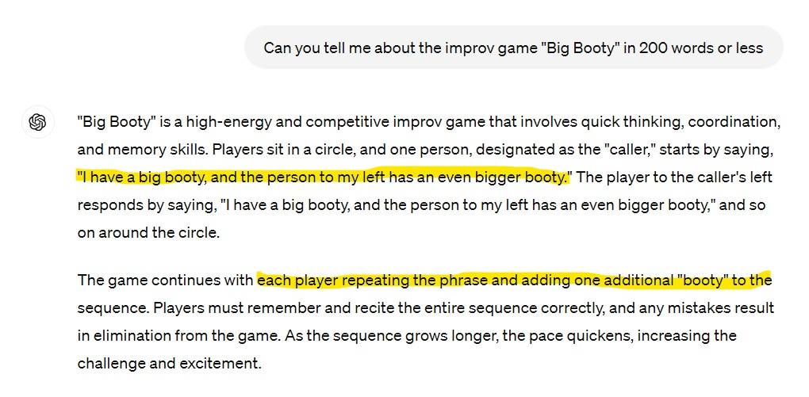

# Improving improv related responses with RAG
#### Author: Alex Loh Last updated: May 2024
---

ChatGPT3.5 is very bad at improv-related prompts, often producing confident-sounding but nonsensical responses. Here is an example of asking ChatGPT3.5 about the game "Big Booty":

Our goal is to improve these repsonses using RAG by ingesting information scrapped from the web. We follow closely the example from Don Woodlocks' [How to set up RAG - Retrieval Augmented Generation](https://www.youtube.com/watch?v=P8tOjiYEFqU).

The basic flow is to scrap descriptions for all improv game pages from authoritative web source and calculate their embedding. For each query, we find the most relevant page using a dot product of the query's embedding against the embeddings all pages. This one page is then passed as context to the OpenAI call.

## Scrapping sources for RAG
We scrap descriptions for improv games from [Improv Encyclopedia](https://improvencyclopedia.org/games/index.html) using [BeautifulSoup](https://pypi.org/project/beautifulsoup4/).  A total of 575 games were scrapped into the file improvencyclopedia.csv. Files that produced errors during scrapping are written to scrap_errors.txt. Source for the scrapper script is found in this repo under scrapper.py.

The format of the CSV file is one row per entry, and one column for each row containing the context, including surrounding words such as the name of the game and instructions for the LLM. Each row looks like this:

    "This improv game is called <NAME OF GAME> and its description is as follows: <DESC FROM WEB PAGE>"

The reason this is a CSV file is to make it easier to load into pandas which handles the embedding logic later.

## OpenAI
For the RAG answers, we invoke gpt-3.5-turbo by passing it the top three most relevant pages concentated as context:

    {"role": "assistant", "content": "Use the following context to help you: "+context}

This context is visible on the response page.

Additionally we use OpenAI text-embedding-3-small to generate embeddings for both the question and scrapped data. We use the dot product between the embedding of the question and the page to evaluate how relevant the page is to the question. This dot product is also shown in the response.

## Frontend
We built a web interface using [Python Anywhere](https://www.pythonanywhere.com/) following the guide at https://blog.pythonanywhere.com/210/. Frontend allows users to ask a question and compare side-by-side the answers from ChatGPT with and without RAG. Context and relevance score are also shown.

A demo is currently hosted at: https://alexloh.pythonanywhere.com/rag

## Observations

ChatGPT 3.5 is not great at answering improv questions, and gets about 50% of them wrong. After extensive testing however, it seems our authoritative source is not perfect either -- easy improvements can be made by simply scrapping more data. Some well-known games (eg Mind Meld, Blind Lines) are missing; while for some others the site describes uncommon ways of playing them. Nonetheless, the RAG-augment answers are far better than the original ones.

It is hilarious how often ChatGPT insists a game encourages "creativity" and "quick thinking".
